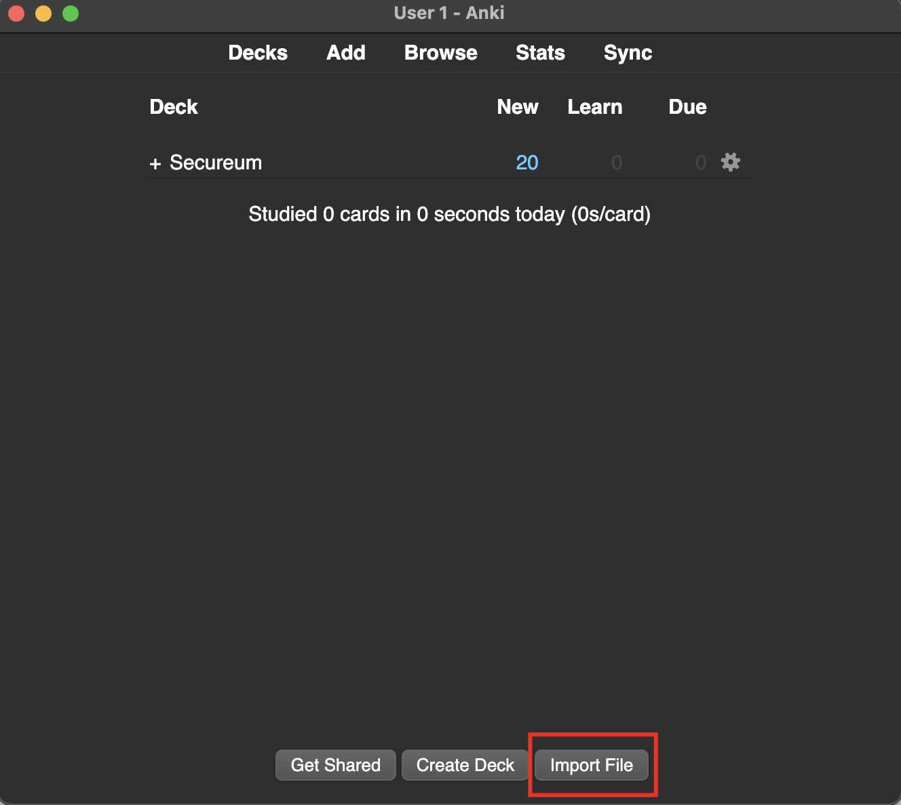

# Anki Cards (Spaced Repetition) for Web3 Developers

### Index

-   Secureum
    -   [Ethereum 101](https://secureum.substack.com/p/ethereum-101)

### How to use?

1. Download [Anki](https://apps.ankiweb.net/)
2. Download any deck you want from the repo.
3. Import File in Anki

